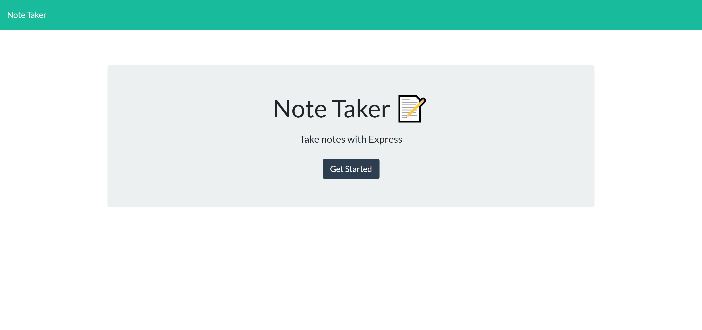
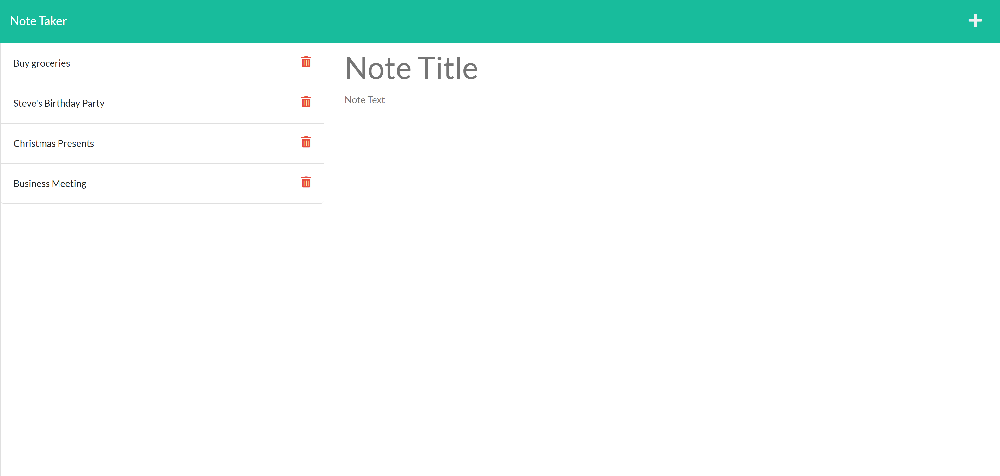

# Note Taker

## Description
A note taking app using an Express.js back end to store and display previous notes as well as save new notes.

## Table of Contents
* [Link](#link)
* [Installation](#installation)
* [Usage](#usage)
* [Routes](#routes)
* [License](#license)
* [Questions](#questions)

## Link
[Click here](https://mysterious-savannah-48786.herokuapp.com) to go to the deployed Note Taker site.

## Installation
To install this app on your machine for editing or testing:

1. Install [Node.js](https://nodejs.org/en/) if you haven't already.
2. Clone this repository onto your computer.
3. Navigate to the root of this repository on the command line.
4. Run `npm install` on the command line.
5. Run `npm install uniqid` to install Uniqid.

## Usage
1. Go to https://mysterious-savannah-48786.herokuapp.com in your browser.
2. Click the Get Started button to view notes.
3. Click the corresponding sections in the right-hand column to type in a new Note Title and Note Text.
4. Click on the Save icon in the top right corner to save your new note.
5. Click on a note in the left-hand column to view its contents.
6. Click on the Trash icon to delete a note.

## Routes
This application utilizes a couple routes:
- `/` for the Note Taker homepage.
- `/notes` for the notes page.

- GET `/notes`: Retrieves the previously saved notes.
- POST `/notes`: Creates a new note and saves it.
- DELETE `/notes`: Deletes a note.

## License
Licensed under the [MIT](https://choosealicense.com/licenses/mit/) license.

## Questions
- [GitHub](https://github.com/kg-phantom)
- [Email](mailto:ksurbayan@gmail.com)